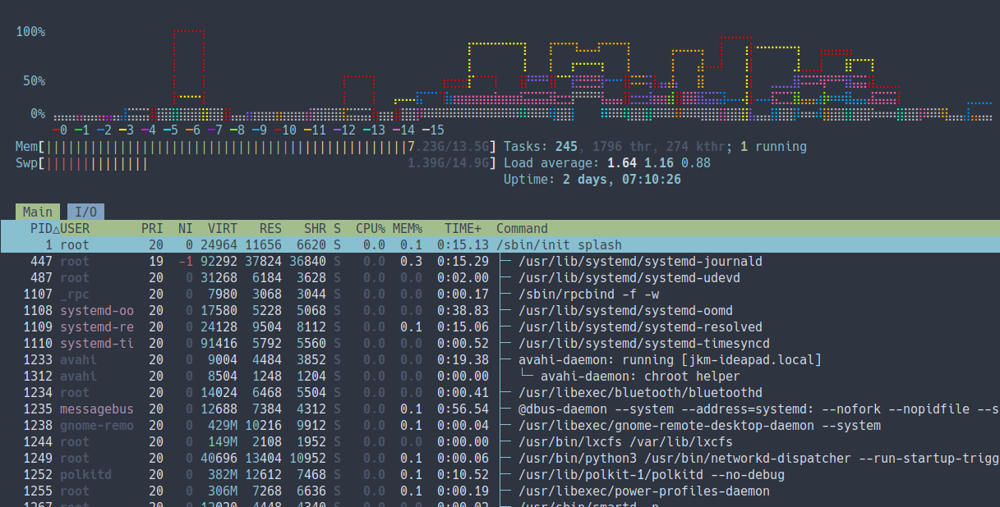

# htop 3.3.0, decompiled

`decomp/` is C decompiled from `./htop` using Ghidra 12.1.4 and Ubuntu's debug symbols for that exact build (`htop-dbgsym_3.3.0-4build1`, DWARF only, no source code). It rebuilds into a working htop:

```sh
make -C decomp            # -> decomp/htop
```

It needs `gcc` and `libncurses-dev`. libnl-3 is linked directly by its `.so.200` name, so its `-dev` package isn't required.

## Layout

| Path | Contents |
|---|---|
| `decomp/src/**.c` | 592 functions, in the original source files from the DWARF line info (`Panel.c`, `linux/Platform.c`, …). Static inline functions from headers are in `<Header>_inline.c`. |
| `decomp/src/data.S` | `.rodata`, `.data.rel.ro`, `.data` and `.bss` of the original binary, byte-exact, with pointers turned into symbols. Global data keeps its original layout and initial values. |
| `decomp/include/types.h` | htop's structs, enums and typedefs from DWARF (`Panel`, `Meter`, `Process`, `Settings`, …). |
| `decomp/include/globals.h` | Declarations of global data (`Process_fields`, `CRT_colors`, `Settings`, …). |
| `decomp/include/functions.h` | Prototypes of all functions, with the original names, parameter names and types. |
| `decomp/include/externs.h` | Library imports. |
| `decomp/include/ghidra.h` | Ghidra types and helpers (`undefined8`, `CONCAT44`, `SUB168`, …). |

## Changes from stock htop

- **CPU history graph**: the per-core CPU meters (`AllCPUs*`, `LeftCPUs*`, `RightCPUs*`) are replaced by one line graph of all cores over the last 60 s (right edge = now), 6 rows plus a legend row. Each core is a line in its own colour (16 colours on 256-colour terminals, 14 on 8-colour ones), drawn with braille dots (`*` without UTF-8). A `LeftCPUs*` meter draws it over the full header width and the `RightCPUs*` meter beside it stays empty. Code: `decomp/src/CPUHistory.c`, wired in `decomp/src/CPUMeter.c`.



## Reading the code

- Functions, parameters and globals have their original names and types, so fields print as `this->selected` and `pMVar3->super.klass`. Locals that the optimizer kept only in registers get Ghidra names (`iVar1`, `pcVar2`).
- `/* Unresolved local var: ... */` comments name source variables that were optimized away.
- Stack variables are views into a per-function `__frame` array at their original offsets, e.g. `(*(char (*) [256])(__fp - 0x1148))`. Overlapping uses of a stack slot then alias as in the binary.
- String literals appear as their original address, with the text in a comment: `((char *)(long)&s_1_day__0014904a /* "1 day, " */)`.
- Virtual calls (`klass->display(...)`) pass 6 arguments; the extras are unused padding. Some are written `(*(code *)(...))(...)` because Ghidra types the method slot through the base class.

## Adding features

Edit `decomp/` directly; it is now the source. New `.c` files anywhere under `decomp/src/` are picked up by the Makefile. Include `htop.h` to get all types, globals and prototypes.

## Regenerating (only if you change the pipeline)

```sh
tools/prepare_debug.sh   # download the debug symbols and prepare debug/
tools/ghidra.sh full     # import debug/htop with DWARF, analyse, fix, export to raw/ (~3 min)
tools/build.sh           # raw/ -> decomp/ (tools/gen.py, tools/fix_errors.py), then make
```

`tools/gen.py` refuses to overwrite hand edits in `decomp/` unless given `--force`.

- **`prepare_debug.sh`**: Ghidra can't read Ubuntu's debug file as shipped. This script decompresses it, relabels the dwz partial units as compile units (`fix_dwz.py`), and gives the import copy of the binary a matching debuglink CRC. It also writes `this_types.tsv` (via `dwarf_this.py`): the real struct type of each `this`/`cast` parameter.
- **`ghidra_scripts/ApplyFixes.java`** prepares the program before export:
  - merges duplicate DWARF types and names struct padding;
  - restores `this` parameter types;
  - makes symbol names C-safe;
  - applies library prototypes from `extern_protos.h`;
  - sets per-call printf/scanf signatures parsed from the format strings;
  - pads indirect calls to all six argument registers.
- **`ghidra_scripts/ExportC.java`** writes the functions, types, data, relocations and stack-frame layouts.
- **`gen.py`** turns the export into compilable C.
- **`fix_errors.py`** rewrites the places where the compiler reports Ghidra type mistakes, as bit reinterpretations.
- **`overrides/`** holds hand-written versions of the 3 variadic functions.

Checks:

```sh
tools/smoke_test.py decomp/htop               # drives 13 UI scenarios in a pty
tools/compare_screens.sh ./htop decomp/htop   # diffs rendered screens against the original
tools/check_formats.py decomp/src             # printf/scanf argument counts
```

The tools live in `~/tools`: Ghidra 12.1.4, and Temurin JDK 21 (Ghidra needs a full JDK).
